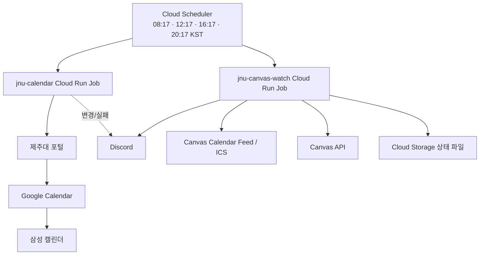

# 제주대학교 일정 자동화

제주대학교 포털의 **수업 시간표를 Google Calendar에 자동 동기화**하고, 선택적으로 제주대학교 Canvas의 **새 과제·과제 변경·새 공지·가까운 마감**을 Discord로 알려주는 개인용 자동화 프로젝트입니다.

이 README는 **개발이나 Google Cloud를 잘 모르는 사람도 처음부터 설치할 수 있게** 작성했습니다. 로컬 PC에 Docker, Node.js, gcloud를 설치할 필요가 없습니다. 브라우저에서 **Google Cloud Shell**만 열 수 있으면 됩니다.

> 이 프로젝트는 제주대학교 학생 개인 사용을 전제로 합니다. 포털 비밀번호, Canvas API 토큰, Canvas Calendar Feed URL, Discord Webhook URL은 모두 비밀값으로 취급하세요. GitHub 코드나 공개 채팅, 스크린샷에 올리지 마세요.

---

## 무엇을 해주나요?

### 1. 제주대 포털 시간표 → Google Calendar

- 현재 학기 수업을 자동 조회합니다.
- 수업 시간, 강의실, 휴강, 보강, 온라인 수업 변경을 반영합니다.
- 연속 수업은 가능한 경우 하나의 일정으로 합칩니다.
- 프로그램이 만든 일정만 수정하므로 사용자가 직접 만든 Google Calendar 일정은 건드리지 않습니다.
- 포털 응답이 비정상적으로 비거나 크게 줄면 대량 삭제를 막습니다.
- Google Calendar를 Galaxy의 삼성 캘린더와 동기화해서 볼 수 있습니다.
- Discord를 연결하면 **시간표가 실제로 바뀌었을 때** 또는 **동기화가 실패했을 때** 알림을 받을 수 있습니다.

### 2. Canvas 과제·공지 → Discord

선택 기능입니다. 시간표 기능 설치 후 추가할 수 있습니다.

- 새 과제 등록 알림
- 과제 제목 또는 마감일 변경 알림
- 아직 마감되지 않은 과제 삭제 알림
- 새 공지사항 알림
  - 과목명
  - 공지 제목
  - 본문 일부
  - Canvas 원문 링크
- 하루 한 번, **D-DAY~D-3의 미완료 과제**를 묶어서 리마인드
- 이미 제출/완료된 과제는 Canvas가 완료 상태로 보고하는 경우 리마인드에서 제외
- 첫 실행 때 기존 과제와 공지를 전부 새 알림으로 보내지 않고 기준 상태만 저장

기본 자동 실행 시각은 모두 한국 시간 기준 **08:17, 12:17, 16:17, 20:17**입니다.

---

## 전체 구조



Cloud Run Job은 필요할 때 한 번 실행되고 종료됩니다. 24시간 켜져 있는 서버를 운영하는 구조가 아닙니다.

---

# 설치 전 준비물

설치를 시작하기 전에 아래를 준비하세요.

| 준비물 | 필수 여부 | 용도 |
| --- | --- | --- |
| 제주대학교 포털 계정 | 필수 | 시간표 조회 |
| GitHub 계정 | 필수 | 프로젝트 Fork |
| Google 계정 | 필수 | Google Cloud + Google Calendar |
| Google Cloud 결제 계정 | 필수 | Cloud Run 등 GCP 리소스 사용 |
| Discord 서버에서 Webhook을 만들 권한 | 선택 | 시간표/Canvas 알림 |
| 제주대학교 Canvas 계정 | Canvas 기능 사용 시 | 과제·공지 조회 |

### 비용은 얼마나 드나요?

이 프로젝트는 하루 몇 번만 짧게 실행되도록 만들어졌지만 **무료를 보장하지는 않습니다**. Google Cloud의 무료 할당량, 정책, 가격은 바뀔 수 있습니다.

사용하는 주요 서비스는 Cloud Run Jobs, Cloud Scheduler, Secret Manager, Cloud Build, Artifact Registry, Cloud Storage입니다.

처음 사용하는 사람은 Google Cloud Console의 **결제 → 예산 및 알림**에서 작은 예산 알림을 먼저 만들어두는 것을 권장합니다. 예산 알림은 자동 결제 차단 기능은 아닙니다.

---

# PART A. 시간표 자동 동기화 설치

## 1. GitHub에서 이 저장소 Fork하기

원본 저장소:

https://github.com/vividhyeok/jnu-google-calendar

1. 위 저장소를 엽니다.
2. 오른쪽 위 **Fork**를 누릅니다.
3. Owner에 본인 GitHub 계정을 선택합니다.
4. Repository name은 `jnu-google-calendar` 그대로 두는 것을 권장합니다.
5. **Create fork**를 누릅니다.
6. 주소가 `github.com/내아이디/jnu-google-calendar`인지 확인합니다.

Fork는 원본 프로젝트를 본인 GitHub 계정으로 복사하는 작업입니다.

---

## 2. Google Cloud 프로젝트 만들기

1. https://console.cloud.google.com/ 에 접속합니다.
2. Google 계정으로 로그인합니다.
3. 화면 상단의 프로젝트 선택기를 누릅니다.
4. **새 프로젝트 / New Project**를 누릅니다.
5. 프로젝트 이름을 예를 들어 `JNU Calendar`로 정합니다.
6. 생성된 **프로젝트 ID**를 따로 기록합니다.
7. 프로젝트를 생성합니다.
8. 생성한 프로젝트를 현재 프로젝트로 선택합니다.
9. **결제 / Billing**에서 결제 계정을 연결합니다.

중요한 것은 프로젝트 **이름**이 아니라 **프로젝트 ID**입니다.

예:

```text
프로젝트 이름: JNU Calendar
프로젝트 ID: my-jnu-calendar-12345
```

앞으로 명령어의 `YOUR_PROJECT_ID` 자리에 두 번째 값을 넣습니다.

---

## 3. 시간표 전용 Google Calendar 만들기

개인 일정과 자동 생성 수업 일정을 섞지 않는 것을 권장합니다.

1. PC에서 https://calendar.google.com/ 을 엽니다.
2. 왼쪽 **다른 캘린더** 옆 `+`를 누릅니다.
3. **새 캘린더 만들기**를 선택합니다.
4. 이름을 예를 들어 `JNU 시간표`로 만듭니다.
5. 시간대는 `Asia/Seoul`로 설정합니다.
6. 만든 캘린더의 **설정 및 공유**로 들어갑니다.
7. **캘린더 통합 / Integrate calendar**을 찾습니다.
8. **캘린더 ID / Calendar ID**를 복사해 둡니다.

보통 아래처럼 생겼습니다.

```text
xxxxxxxxxxxxxxxxxxxxxxxx@group.calendar.google.com
```

`공개 URL`이나 `비공개 iCal 주소`가 아니라 **Calendar ID**가 필요합니다.

---

## 4. Discord Webhook 만들기 — 선택이지만 Canvas 기능에는 필요

시간표 변경 알림만 필요 없다면 이 단계는 건너뛸 수 있습니다.

하지만 **Canvas 과제·공지 알리미까지 사용할 예정이면 Discord Webhook이 필요합니다.**

Discord에서 보통 다음 순서로 만듭니다.

1. 알림을 받을 Discord 서버를 엽니다.
2. **서버 설정**으로 들어갑니다.
3. **연동 / Integrations**를 엽니다.
4. **Webhooks**를 선택합니다.
5. **New Webhook / 새 Webhook**을 만듭니다.
6. 알림이 올라갈 채널을 선택합니다.
7. **Copy Webhook URL**을 눌러 주소를 복사합니다.

Webhook URL은 비밀번호처럼 취급하세요. URL을 아는 사람은 해당 Webhook으로 메시지를 보낼 수 있습니다.

---

## 5. Google Cloud Shell 열기

Google Cloud Console 오른쪽 위의 **Cloud Shell 활성화** 아이콘을 누릅니다.

하단에 터미널이 열리면 준비가 끝난 것입니다. 처음에는 **Authorize / 승인**을 요구할 수 있습니다.

이 가이드의 터미널 명령은 모두 Cloud Shell에서 실행합니다.

---

## 6. 내 Fork를 Cloud Shell에 내려받기

아래 명령에서 `YOUR_GITHUB_NAME`을 본인 GitHub 아이디로 바꿉니다.

```bash
git clone https://github.com/YOUR_GITHUB_NAME/jnu-google-calendar.git
cd jnu-google-calendar
git remote -v
```

출력된 `origin`이 본인의 Fork 주소인지 확인합니다.

예:

```text
origin  https://github.com/myname/jnu-google-calendar.git
```

이미 예전에 clone했다면 다시 clone하지 말고 다음처럼 최신 코드를 받으면 됩니다.

```bash
cd ~/jnu-google-calendar
git pull --ff-only origin main
```

---

## 7. 시간표 자동화 배포하기

아래에서 `YOUR_PROJECT_ID`를 본인의 Google Cloud 프로젝트 ID로 바꿉니다.

```bash
bash scripts/deploy.sh YOUR_PROJECT_ID asia-northeast3
```

예:

```bash
bash scripts/deploy.sh my-jnu-calendar-12345 asia-northeast3
```

처음 실행하면 필요한 Google Cloud API와 서비스 계정, Secret Manager, Cloud Run Job 등을 자동으로 준비합니다. 첫 Docker 빌드는 Chrome을 포함하므로 몇 분 걸릴 수 있습니다.

### 배포 중 무엇을 입력하나요?

스크립트가 차례대로 값을 묻습니다.

| 화면에 나오는 질문 | 입력할 값 |
| --- | --- |
| `PORTAL_USERNAME` | 제주대학교 포털 아이디 |
| `PORTAL_PASSWORD` | 제주대학교 포털 비밀번호 |
| `Enable Discord notifications? [y/N]` | Discord를 쓸 경우 `y`, 아니면 Enter |
| `DISCORD_WEBHOOK_URL` | `y`를 선택했을 때 Discord Webhook URL |
| `Google Calendar ID` | 3단계에서 복사한 Calendar ID |

포털 비밀번호와 Webhook URL을 입력할 때 화면에 글자가 나타나지 않는 것은 정상입니다.

### 아주 중요한 보안 규칙

절대 다음처럼 비밀번호나 토큰을 명령어에 직접 적지 마세요.

```text
잘못된 예: PORTAL_PASSWORD=mypassword123 ...
```

배포 스크립트의 숨김 입력을 사용하면 shell history에 비밀값을 남기지 않습니다.

---

## 8. Google Calendar를 서비스 계정과 공유하기

배포 중 아래와 비슷한 문장이 나오면 스크립트가 기다립니다.

```text
Share the dedicated calendar with jnu-calendar@YOUR_PROJECT_ID.iam.gserviceaccount.com
```

이때:

1. 출력된 서비스 계정 이메일을 복사합니다.
2. Google Calendar로 돌아갑니다.
3. `JNU 시간표` 캘린더의 **설정 및 공유**를 엽니다.
4. **특정 사용자 및 그룹과 공유**에서 사용자 추가를 누릅니다.
5. 서비스 계정 이메일을 붙여넣습니다.
6. 권한은 **일정 변경 / Make changes to events**를 선택합니다.
7. 저장 또는 보내기를 누릅니다.
8. Cloud Shell로 돌아와 Enter를 누릅니다.

서비스 계정은 본인 Gmail 주소와 다른 것이 정상입니다.

`변경 및 공유 관리` 같은 더 높은 권한은 필요하지 않습니다.

---

## 9. 첫 수동 실행하기

배포가 끝나도 시간표 Scheduler는 아직 직접 켜야 합니다. 먼저 실제 동기화가 정상인지 확인합니다.

```bash
gcloud run jobs execute jnu-calendar \
  --project=YOUR_PROJECT_ID \
  --region=asia-northeast3 \
  --wait
```

성공하면 마지막에 실행이 성공적으로 완료됐다는 메시지가 나옵니다.

그다음 Google Calendar의 `JNU 시간표` 캘린더를 열어 실제 수업이 들어왔는지 확인합니다.

### 로그에서 기대하는 흐름

대략 다음과 같은 순서가 보이면 정상입니다.

```text
Sync started
Portal SSO completed at /index.htm
Portal fetch succeeded: ... lecture rows
Calendar diff: ... changed, ... removed
Sync completed
```

포털 조회가 실패하면 Calendar 변경 전에 중단하도록 되어 있습니다.

---

## 10. 한 번 더 수동 실행하기

첫 실행만 성공하고 두 번째에 중복 일정이 생기는 문제를 잡기 위해 한 번 더 실행하는 것을 권장합니다.

```bash
gcloud run jobs execute jnu-calendar \
  --project=YOUR_PROJECT_ID \
  --region=asia-northeast3 \
  --wait
```

두 번째 실행 후 같은 수업이 중복 생성되지 않았는지 확인합니다.

---

## 11. 시간표 자동 실행 켜기

두 번 모두 문제없으면 Scheduler를 만듭니다.

```bash
bash scripts/schedule.sh YOUR_PROJECT_ID asia-northeast3
```

정상적으로 설정되면 한국 시간 기준 다음 시각에 자동 실행됩니다.

```text
08:17
12:17
16:17
20:17
```

이제 PC를 끄거나 Cloud Shell 창을 닫아도 Google Cloud에서 자동 실행됩니다.

---

## 12. Galaxy / 삼성 캘린더에서 보기

Google Calendar에 정상적으로 들어왔다면 삼성 캘린더에서 별도의 서버를 만들 필요는 없습니다.

Galaxy에서 대략 다음을 확인합니다. One UI 버전에 따라 메뉴 이름은 조금 다를 수 있습니다.

1. 휴대폰 설정에서 사용 중인 Google 계정의 **Calendar 동기화**가 켜져 있는지 확인합니다.
2. 삼성 캘린더 앱을 엽니다.
3. 메뉴 → 캘린더 관리로 들어갑니다.
4. Google 계정 아래의 `JNU 시간표` 캘린더를 켭니다.
5. 일정이 바로 보이지 않으면 Google 계정 동기화를 한 번 새로고침합니다.

Google Calendar에는 있는데 삼성 캘린더에만 없다면 이 프로젝트보다 휴대폰의 Google Calendar 동기화 설정을 먼저 확인하세요.

---

# PART B. Canvas 과제·공지 Discord 알리미 설치

Canvas 기능은 시간표 Cloud Run Job과 **별도의 `jnu-canvas-watch` Job**으로 돌아갑니다. 한쪽이 실패해도 다른 쪽에 영향을 주지 않도록 분리되어 있습니다.

현재 Canvas 알리미는 Google Calendar에 과제를 새로 쓰지 않습니다. Canvas Calendar Feed를 이미 Google Calendar에 구독해 사용하고 있다면 그대로 두면 됩니다.

Canvas watcher의 역할은 **변경 감지와 Discord 알림**입니다.

---

## 13. 먼저 Discord가 연결되어 있는지 확인

Canvas watcher는 Discord Webhook을 사용하므로 `jnu-discord-webhook` Secret이 필요합니다.

시간표 설치 때 Discord를 건너뛰었다면 다음 명령을 다시 실행합니다.

```bash
bash scripts/deploy.sh YOUR_PROJECT_ID asia-northeast3
```

이미 저장된 포털 아이디/비밀번호 질문에는 변경할 필요가 없다면 Enter를 눌러 기존 값을 유지하고, 아래 질문에서는 `y`를 입력합니다.

```text
Enable Discord notifications? [y/N]: y
```

그다음 Discord Webhook URL을 숨김 입력합니다.

재배포가 끝난 후 기존 시간표가 정상인지 확인하고 다음 단계로 갑니다.

---

## 14. Canvas API 토큰 만들기

제주대학교 Canvas에 로그인합니다.

https://canvas.jejunu.ac.kr/

Canvas 화면에서 보통 다음 순서입니다.

1. 왼쪽 전역 메뉴에서 **계정 / Account**를 누릅니다.
2. **설정 / Settings**을 엽니다.
3. 아래로 내려 **Approved Integrations / 승인된 통합** 영역을 찾습니다.
4. **New Access Token / 새 액세스 토큰**을 누릅니다.
5. 목적에는 예를 들어 `jnu-canvas-watch`라고 입력합니다.
6. 화면에서 허용하는 만료일을 설정합니다.
7. 토큰을 생성합니다.
8. 생성 직후 표시되는 토큰 문자열을 안전한 곳에 잠깐 복사합니다.

토큰은 계정 비밀번호와 비슷한 수준의 비밀값입니다. **이 GitHub 저장소에 절대 커밋하지 마세요.**

### Canvas 토큰 만료 주의

Canvas는 기관 정책과 Canvas 버전에 따라 사용자 토큰 만료 제한을 적용할 수 있습니다. 2026년 Canvas 정책에서는 학생용 사용자 생성 토큰의 최대 만료 기간이 짧게 제한될 수 있으므로, 생성 화면에서 허용하는 가장 적절한 날짜를 선택하세요.

토큰이 만료되면 아래의 **Canvas 토큰 갱신** 절차로 새 Secret 버전을 추가하면 됩니다.

---

## 15. Canvas Calendar Feed URL 복사하기

이 URL은 과제와 Canvas 캘린더 이벤트를 ICS 형식으로 읽는 데 사용합니다.

Canvas에서:

1. 왼쪽 메뉴의 **Calendar / 캘린더**를 엽니다.
2. 화면의 **Calendar Feed / 캘린더 피드**를 누릅니다.
3. 표시되는 URL을 복사합니다.

보통 다음과 비슷한 형태입니다.

```text
https://canvas.jejunu.ac.kr/feeds/calendars/user_긴문자열.ics
```

이 주소는 단순 공개 링크가 아니라 **개인 캘린더에 접근할 수 있는 비밀 URL**로 취급하는 것이 안전합니다.

브라우저에서 이 URL을 열면 `.ics` 파일이 다운로드되거나 캘린더 텍스트가 표시될 수 있습니다. 정상입니다. 같은 URL을 서버가 주기적으로 다시 읽어서 과제의 추가·변경·삭제를 비교합니다.

---

## 16. Canvas watcher 배포하기

최신 코드인지 먼저 확인합니다.

```bash
cd ~/jnu-google-calendar
git pull --ff-only origin main
```

그다음 실행합니다.

```bash
bash scripts/deploy-canvas-watch.sh YOUR_PROJECT_ID asia-northeast3
```

Canvas 관련 Secret이 아직 없으면 스크립트가 다음 값을 숨김 입력으로 묻습니다.

```text
CANVAS_API_TOKEN
CANVAS_ICS_URL
```

방금 만든 Canvas API 토큰과 Calendar Feed URL을 각각 붙여넣고 Enter를 누릅니다.

스크립트는 자동으로 다음 작업을 합니다.

1. Canvas API 토큰과 ICS URL을 Secret Manager에 저장
2. Canvas 상태 저장용 비공개 Cloud Storage bucket 생성
3. Docker 이미지 빌드
4. `jnu-canvas-watch` Cloud Run Job 생성 또는 업데이트
5. 실제 Canvas API + ICS + Cloud Storage를 사용하는 첫 수동 실행
6. 첫 실행이 성공한 경우 Scheduler 생성
7. 08:17, 12:17, 16:17, 20:17 자동 실행 활성화

마지막에 다음과 비슷한 출력이 나오면 배포가 끝난 것입니다.

```text
Canvas watcher deployed and scheduled: jnu-canvas-watch
State bucket: gs://YOUR_PROJECT_ID-canvas-watch-state
```

---

## 17. Canvas 첫 실행에서 알림이 어떻게 처리되나요?

첫 실행은 현재 Canvas 상태를 **baseline / 기준 상태**로 저장합니다.

따라서 기존 과제와 기존 공지 수십 개가 갑자기 `새 과제`, `새 공지`로 Discord에 쏟아지지 않습니다.

다만 오늘 기준 D-DAY~D-3의 미완료 과제가 있다면 **오늘의 과제 체크** 요약은 첫 실행에서도 올 수 있습니다.

이후 실행부터 새로 생기거나 바뀐 항목을 비교합니다.

---

## 18. Discord 알림 예시

### 새 과제

```text
JNU 과제 알리미

📚 Canvas 과제 변경

[새 과제] [소프트웨어공학] 요구사항 명세서 제출
마감: 2026-09-15
https://canvas.jejunu.ac.kr/...
```

### 과제 마감 변경

```text
JNU 과제 알리미

📚 Canvas 과제 변경

[과제 변경] [운영체제] 프로세스 과제
마감: 2026-09-12 → 2026-09-16
https://canvas.jejunu.ac.kr/...
```

### 과제 삭제

```text
JNU 과제 알리미

📚 Canvas 과제 변경

[과제 삭제] [데이터마이닝] 실습 3
기존 마감: 2026-09-20
```

### 새 공지

```text
JNU 공지 알리미

📢 새 공지사항
[정보·컴퓨터교과논리및논술]
3주차 수업 안내

이번 주 수업은 강의실 변경으로 인해 ...

https://canvas.jejunu.ac.kr/...
```

공지 본문이 너무 길면 앞부분만 표시하고 원문 Canvas 링크를 붙입니다.

### 하루 한 번 가까운 마감

```text
JNU 과제 알리미

📚 오늘의 과제 체크

D-DAY  [교육철학및교육사] 자기소개서 제출
https://canvas.jejunu.ac.kr/...

D-1  [소프트웨어공학] 요구사항 분석
https://canvas.jejunu.ac.kr/...

D-3  [데이터마이닝] 실습 과제 1
https://canvas.jejunu.ac.kr/...
```

Job은 하루 4번 실행되지만 이 리마인드는 **하루 최대 한 번**만 전송합니다.

---

# 비밀값을 바꿔야 할 때

## Canvas API 토큰 갱신

Canvas 토큰이 만료되기 전에 Canvas에서 새 토큰을 만든 뒤 Cloud Shell에서 아래를 실행합니다.

```bash
PROJECT="YOUR_PROJECT_ID"

read -r -s -p "새 Canvas API 토큰 입력(화면에 안 보임): " CANVAS_TOKEN
echo

printf '%s' "$CANVAS_TOKEN" | gcloud secrets versions add jnu-canvas-api-token \
  --project="$PROJECT" \
  --data-file=-

unset CANVAS_TOKEN
```

`jnu-canvas-watch`는 `latest` Secret 버전을 사용하므로 보통 코드 재배포 없이 다음 실행부터 새 토큰을 사용합니다.

수동으로 바로 확인하려면:

```bash
gcloud run jobs execute jnu-canvas-watch \
  --project=YOUR_PROJECT_ID \
  --region=asia-northeast3 \
  --wait
```

---

## Canvas Calendar Feed URL 갱신

Calendar Feed URL을 재발급하거나 변경했다면:

```bash
PROJECT="YOUR_PROJECT_ID"

read -r -s -p "새 Canvas ICS URL 입력(화면에 안 보임): " CANVAS_ICS_URL
echo

printf '%s' "$CANVAS_ICS_URL" | gcloud secrets versions add jnu-canvas-ics-url \
  --project="$PROJECT" \
  --data-file=-

unset CANVAS_ICS_URL
```

다음 Canvas watcher 실행부터 `latest` 버전을 읽습니다.

---

## 제주대 포털 비밀번호가 바뀐 경우

시간표 Job은 배포 당시 선택한 Secret 버전을 사용하므로 가장 쉬운 방법은 배포 스크립트를 다시 실행하는 것입니다.

```bash
cd ~/jnu-google-calendar
bash scripts/deploy.sh YOUR_PROJECT_ID asia-northeast3
```

기존 아이디는 Enter로 유지하고, `PORTAL_PASSWORD` 질문에서 새 비밀번호를 입력합니다.

Google Calendar ID도 다시 묻기 때문에 기존 Calendar ID를 준비해 두세요.

Canvas까지 사용 중이라면 Discord 질문에서 기존 Webhook 연결을 유지하도록 `y`를 선택하세요.

---

# 정상 동작 확인 명령

## 시간표 Job 직접 실행

```bash
gcloud run jobs execute jnu-calendar \
  --project=YOUR_PROJECT_ID \
  --region=asia-northeast3 \
  --wait
```

## Canvas watcher 직접 실행

```bash
gcloud run jobs execute jnu-canvas-watch \
  --project=YOUR_PROJECT_ID \
  --region=asia-northeast3 \
  --wait
```

## Scheduler 목록 확인

```bash
gcloud scheduler jobs list \
  --project=YOUR_PROJECT_ID \
  --location=asia-northeast3
```

정상 설치라면 보통 다음 두 Scheduler를 볼 수 있습니다.

```text
jnu-calendar-sync
jnu-canvas-watch
```

Canvas 기능을 설치하지 않았다면 `jnu-calendar-sync`만 있는 것이 정상입니다.

---

# 문제 해결

## `Portal authentication failed`

포털 아이디 또는 비밀번호가 바뀌었거나 제주대 SSO 흐름이 변경됐을 가능성이 있습니다.

먼저 브라우저에서 제주대학교 포털에 같은 계정으로 직접 로그인되는지 확인하세요. 비밀번호를 바꿨다면 위의 **포털 비밀번호가 바뀐 경우** 절차로 다시 배포합니다.

---

## Google Calendar에 일정이 안 생김

다음을 확인하세요.

1. `jnu-calendar` 실행 자체가 성공했는지
2. 서비스 계정 이메일을 전용 Calendar에 공유했는지
3. 공유 권한이 **일정 변경 / Make changes to events**인지
4. 입력한 값이 Calendar ID인지
5. 개인 iCal URL이나 공개 URL을 실수로 넣지 않았는지

---

## `Canvas API request failed (HTTP 401)` 또는 `403`

가장 흔한 원인은 Canvas API 토큰 만료 또는 권한 문제입니다.

Canvas에서 새 Access Token을 만든 뒤 **Canvas API 토큰 갱신** 절차로 새 Secret 버전을 추가하세요.

학교가 사용자 API 토큰 정책을 변경하면 Canvas 화면에서 토큰 생성이 제한될 수도 있습니다.

---

## Canvas watcher 배포 중 `Missing Discord webhook secret`

시간표 설치 단계에서 Discord를 건너뛴 상태입니다.

다시 다음을 실행하고 Discord 질문에서 `y`를 선택하세요.

```bash
bash scripts/deploy.sh YOUR_PROJECT_ID asia-northeast3
```

그 후 다시:

```bash
bash scripts/deploy-canvas-watch.sh YOUR_PROJECT_ID asia-northeast3
```

---

## Canvas 과제가 Google Calendar에는 보이는데 Discord에는 안 옴

Google Calendar의 Canvas 구독과 `jnu-canvas-watch`는 서로 독립적입니다.

먼저 Canvas watcher를 직접 실행합니다.

```bash
gcloud run jobs execute jnu-canvas-watch \
  --project=YOUR_PROJECT_ID \
  --region=asia-northeast3 \
  --wait
```

실행이 성공했는데 새 과제 알림이 없다면 그 과제가 **첫 baseline 이전부터 이미 존재했던 항목인지** 확인하세요. 첫 실행은 기존 항목을 새 과제로 알리지 않습니다.

---

## Discord 알림이 매 실행마다 오지 않음

정상입니다.

시간표는 실제 변경이나 실패가 있을 때만 알립니다. Canvas는 새 과제·변경·삭제·새 공지가 있을 때 알리고, 가까운 마감 리마인드는 하루 최대 한 번만 보냅니다.

알림이 없다는 이유만으로 Job이 실행되지 않은 것은 아닙니다.

---

## `PERMISSION_DENIED`, IAM 오류

본인이 소유하거나 충분한 권한이 있는 Google Cloud 프로젝트인지 확인하세요. 학교나 회사 조직 계정의 프로젝트는 조직 정책으로 IAM 변경이 막힐 수 있습니다.

가능하면 개인 Google 계정에서 직접 만든 프로젝트 사용을 권장합니다.

---

## 첫 빌드가 너무 오래 걸림

Docker 이미지 안에 Chrome/Puppeteer가 포함되므로 첫 Cloud Build는 몇 분 걸릴 수 있습니다. `STATUS: SUCCESS`가 나오기 전까지 Cloud Shell을 닫지 않는 것이 좋습니다.

`npm`, `pnpm`, Debian 패키지 설치 경고가 출력되더라도 마지막 Cloud Build 상태가 `SUCCESS`이면 일반적으로 문제없습니다.

---

# 코드 업데이트하기

본인의 Fork가 원본보다 오래됐다면 GitHub 웹의 **Sync fork** 기능을 사용하는 것이 가장 간단합니다.

Fork를 최신 상태로 만든 다음 Cloud Shell에서:

```bash
cd ~/jnu-google-calendar
git pull --ff-only origin main
```

시간표 코드가 바뀌었다면:

```bash
bash scripts/deploy.sh YOUR_PROJECT_ID asia-northeast3
```

Canvas watcher 코드가 바뀌었다면:

```bash
bash scripts/deploy-canvas-watch.sh YOUR_PROJECT_ID asia-northeast3
```

배포 스크립트는 기존 리소스를 무조건 삭제하고 새로 만드는 방식이 아니라 가능한 경우 기존 Job과 설정을 갱신합니다.

---

# 데이터와 보안

이 프로젝트는 별도의 사용자용 웹 서버나 데이터베이스를 운영하지 않습니다.

시간표 자동화는 제주대 포털 정보를 읽고 Google Calendar API에 필요한 일정만 반영합니다. Canvas watcher는 비교를 위해 Cloud Storage에 작은 상태 JSON을 저장합니다.

Secret Manager에 저장해야 하는 비밀값은 다음과 같습니다.

| Secret | 내용 |
| --- | --- |
| `jnu-portal-username` | 제주대 포털 아이디 |
| `jnu-portal-password` | 제주대 포털 비밀번호 |
| `jnu-discord-webhook` | Discord Webhook URL, 사용 시 |
| `jnu-canvas-api-token` | Canvas API Access Token, Canvas watcher 사용 시 |
| `jnu-canvas-ics-url` | Canvas Calendar Feed URL, Canvas watcher 사용 시 |

Google 서비스 계정 JSON key 파일은 필요하지 않으며 만들지 않는 구성을 사용합니다.

Canvas API Token과 ICS URL을 README, issue, commit, `.env`, Discord 메시지 등에 공개하지 마세요.

---

# 자동화가 관리하는 범위

## 시간표 날짜 범위

한국 시간 기준으로 자동 선택합니다.

```text
봄학기: 3월 1일 ~ 8월 31일
가을학기: 9월 1일 ~ 다음 해 2월 말
```

시작일 이전 7일도 포함합니다. 사용자가 `START_YYYYMMDD`, `END_YYYYMMDD`를 매 학기 바꿀 필요가 없습니다.

학교 공식 학사일정 API로 실제 개강일을 조회하는 방식은 아닙니다.

포털 시간표 데이터 안에 시험 일정이 포함되어 있다면 캘린더에 들어올 수 있지만, 강의계획서나 공지사항에만 있는 시험을 별도로 찾아 추가하지는 않습니다.

---

# 삭제 안전장치

이 프로젝트가 만든 Google Calendar 일정에는 관리 marker가 들어갑니다.

```text
managedBy = jnu-google-calendar-sync
```

따라서 같은 Calendar 안에 사용자가 직접 만든 일정은 관리 대상이 아닙니다.

또한 기존 일정이 있는데 새 포털 응답이 갑자기 0개가 되거나 비정상적으로 크게 감소하면 삭제 작업을 중단합니다. 로그인 실패나 포털 장애 때문에 수업 전체가 지워지는 상황을 막기 위한 장치입니다.

---

# 개발자용

일반 설치 사용자는 이 부분을 몰라도 됩니다.

Node.js 22.12 이상과 pnpm 9.7.1을 사용합니다.

```bash
pnpm install --frozen-lockfile
pnpm test
pnpm typecheck
pnpm build
```

주요 파일:

| 경로 | 역할 |
| --- | --- |
| `src/portalClient.ts` | 제주대 포털 Puppeteer/SSO 로그인 |
| `src/response.ts` | 포털 응답 검증 |
| `src/iCalConverter.ts` | 수업 재구성, 상태/연강 처리 |
| `src/googleCalendar.ts` | Google Calendar diff/upsert/delete 안전 처리 |
| `src/sync.ts` | 시간표 동기화 실행 흐름 |
| `src/canvasWatch.ts` | Canvas ICS/API 조회, 변경 비교, 리마인드 |
| `src/notify.ts` | Discord Webhook 전송 |
| `scripts/deploy.sh` | 시간표 최초 설치/재배포 |
| `scripts/schedule.sh` | 시간표 Scheduler 생성/업데이트 |
| `scripts/deploy-canvas-watch.sh` | Canvas watcher 배포/첫 실행/Scheduler 설정 |
| `src/tests/` | 회귀 테스트 |

CI는 테스트, TypeScript typecheck/build, shell 문법, Docker build, Chrome 실행과 포털 iframe SSO smoke test를 검사합니다.

---

# 알려진 제한

- 제주대학교 포털이나 Canvas의 로그인/API 구조가 변경되면 업데이트가 필요할 수 있습니다.
- Canvas API Token은 학교 정책과 Canvas 정책에 따라 주기적으로 갱신해야 할 수 있습니다.
- Canvas Calendar Feed에 포함되지 않는 항목은 ICS 기반 과제 변경 감지에서 볼 수 없습니다.
- 공지 알림은 Canvas API가 현재 계정에 반환하는 공지를 기준으로 합니다.
- Google Calendar와 삼성 캘린더 사이의 표시 지연은 기기와 Google 계정 동기화 상태의 영향을 받습니다.
- Google Calendar 여러 건의 쓰기는 하나의 데이터베이스 트랜잭션이 아니며, 중간 실패가 있으면 다음 실행에서 다시 비교합니다.
- GCP 서비스의 무료 사용량과 가격은 바뀔 수 있습니다.

---

# 더 자세한 기존 문서

시간표 설치를 별도 문서로 보고 싶다면 [USER_GUIDE_KO.md](./USER_GUIDE_KO.md)를 참고할 수 있습니다.

Canvas watcher의 간단한 기술 메모는 [README.canvas-watch.md](./README.canvas-watch.md)에 있습니다.

[변경 기록](./update.md) · [라이선스](./LICENSE)
